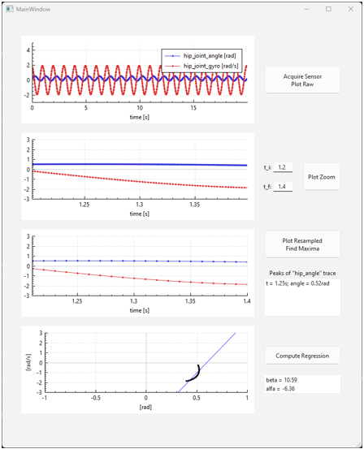
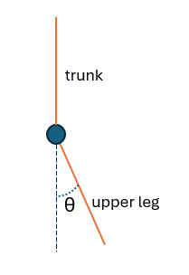

# Hip Joint Dynamics Sensors - GUI Application

This application is designed to visualize sensor signals and processed parameters for monitoring hip joint dynamics. The GUI facilitates real-time data visualization and analysis, aiding in better understanding and interpretation of sensor outputs.

## Features

- Real-time visualization of hip joint sensor signals (angle and gyroscope measurement from IMU).
- Ability to process and display various parameters derived from sensor data.
- Customizable selection of signal region for processing.

## Signal Paramenters

- **Sensor 1**:

  - Measures: Joint angle
  - Units: rad
  - Sampling frequency: 1kHz
  - Sampling freq. jitter: Gaussian; $\sigma$=20$\mu$s

- **Sensor 2**:
  - Measures: Joint angular velocity (from IMU gyroscope)
  - Units: rad.s$^{-1}$
  - Sampling frequency: 400Hz
  - Sampling freq. jitter: Gaussian; $\sigma$=125$\mu$s

## Screenshot of application

- 

## Reference hip joint angle

- 

## How to use it

- App was developed and tested only from inside `Qt Creator 13.0.0`.
- Paramenters of synthetised sensor signals can be modified at beginning of `generate_sensor_data.py`.
- `PYTHON_SCRIPT_PATH` inside file `python_binder.cpp` should be changed to point to root project directory.

## Design Decisions

- **Platform Compatibility:** Developed using Qt 6.7.0 on Windows.
- **Plotting Library:** Using QCustomPlot.
- Python script `generate_sensor_data.py` is used for generating sensor data.
- All other processing is performed in Qt/C++.

## Prerequisites

Coded for:

- Qt 6.7.0
- Python 3.12

## Issues

- Problems with importing `Python.h`, decided to perform a system call to execute the Python script and read output from stdout;
- Tried initially using the plotting library Qwt 6.2.0 but was having issues compiling it;
