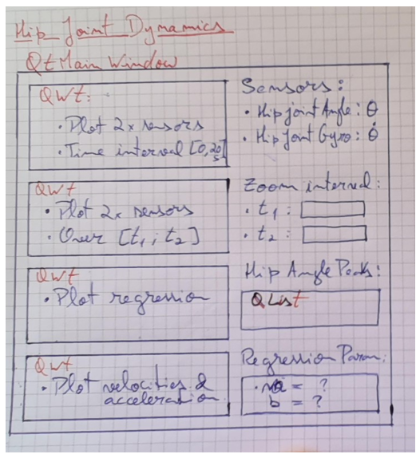

# Hip Joint Dynamics Sensors - GUI Application

This application is designed to visualize sensor signals and processed parameters for monitoring hip joint dynamics. The GUI facilitates real-time data visualization and analysis, aiding in better understanding and interpretation of sensor outputs.

## Design Decisions

- **Platform Compatibility:** Developed using Qt 6.7.0 on Windows.
- **Plotting Library:** Using Qwt 6.2.0, chosen for capabilities in plotting scientific and engineering data.

## Features

- Real-time visualization of hip joint sensor signals.
- Ability to process and display various parameters derived from sensor data.
- Customizable plots for different data types and analysis needs.

## Prerequisites

Ensure you have the following installed to run this application:

- Qt 6.7.0
- Qwt 6.2.0

## GUI Layout

## Signal Paramenters

- **Sensor 1**:

  - Measures: Joint angle
  - Units: $rad$
  - Sampling frequency: $1kHz$
  - Sampling freq. jitter: Gaussian; $\sigma=20\mu s$

- **Sensor 2**:
  - Measures: Joint angular velocity (from IMU gyroscope)
  - Units: $rad.s^{-1}$
  - Sampling frequency: $400Hz$
  - Sampling freq. jitter: Gaussian; $\sigma=125\mu s$
